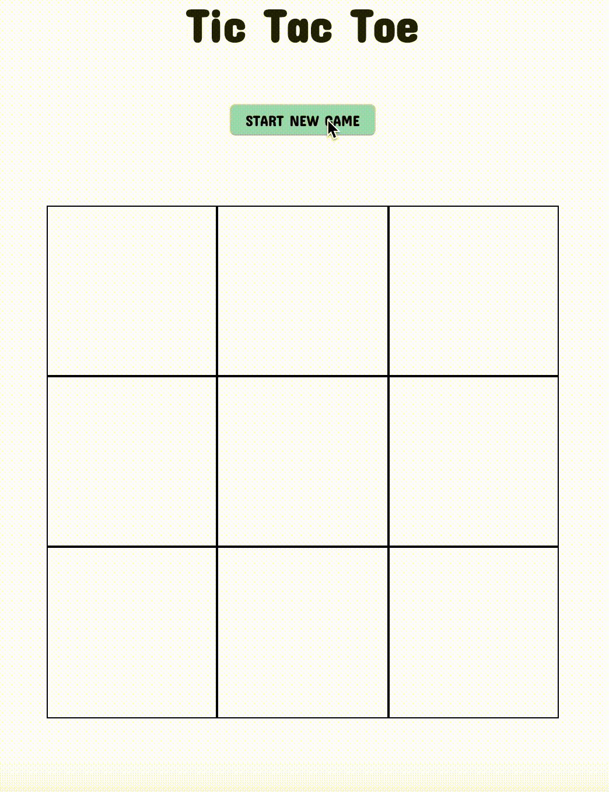

# Tic Tac Toe

## Contents

- [Tic Tac Toe](#tic-tac-toe)
  - [Contents](#contents)
  - [Preview](#preview)
  - [Features](#features)
  - [Install](#install)
  - [Testing](#testing)
      - [To run tests:](#to-run-tests)
  - [Features To Add](#features-to-add)

## Preview



## Features

- The player can start a 3x3 game in the browser
- Two human players take turns playing (X or O) until the board is full or one of them wins
- The winning player (or a tie) is announced
- The users can play again

## Install

Note: You can download node and npm from [here](https://www.npmjs.com/get-npm), if not already installed.

```
git clone https://github.com/itsellej/js-book-search-app.git
cd js-book-search-app
npm install
npm run build
npm start
```
Navigate to `http://localhost:8080` in your browser.

## Testing

The testing library used is [Jest](https://jestjs.io/).

#### To run tests: 

Type `npm run test` in the terminal.

## Features To Add

- A human player can play against a simple computer who randomly selects an available space
- The user can choose to play against an expert computer via an API call to Dan's AWS Lambda https://github.com/pelensky/ttt_network_player
- Test frontend code
- Deploy to Heroku
